<div align="center">


<a href="https://git.io/typing-svg">
  
</a>
<br/>

&nbsp;

&nbsp;

</div>

<br/>

<!-- ══════════════════════════════════════════ -->
<!--         MY TECH JOURNEY (SNAKE)          -->
<!-- ══════════════════════════════════════════ -->

<div align="center">
  
</div>

<br/>

<!-- ══════════════════════════════════════════ -->
<!--          ABOUT ME & TECH ARSENAL         -->
<!-- ══════════════════════════════════════════ -->

<div align="center">
  
</div>

<br/>

<!-- ══════════════════════════════════════════ -->
<!--       CURRENTLY BUILDING SECTION         -->
<!-- ══════════════════════════════════════════ -->

<div align="center">
  
</div>

<br/>

<!-- ══════════════════════════════════════════ -->
<!--         SKILL BARS                       -->
<!-- ══════════════════════════════════════════ -->

<div align="center">

### 🎯 &nbsp; Proficiency Radar

</div>

```text
  Full Stack Dev   ████████████████████  100% ⚡
  Python           ███████████████████░   95% 🐍
  React / Next.js  ██████████████████░░   90% ⚛️
  System Design    █████████████████░░░   88% 🏗️
  DevOps / CI/CD   ████████████████░░░░   82% 🐳
  AI / ML          ███████████████░░░░░   78% 🤖
  Cloud (GCP/AWS)  ██████████████░░░░░░   72% ☁️
```

<br/>

---

<!-- ══════════════════════════════════════════ -->
<!--           GITHUB STATS GRID              -->
<!-- ══════════════════════════════════════════ -->

<div align="center">

### 📊 &nbsp; Battle Statistics

<br/>

<picture>
  
</picture>

<br/><br/>

<a href="https://github.com/dwivedi-mohit">
  
</a>
&nbsp;
<a href="https://github.com/dwivedi-mohit">
  
</a>

<br/><br/>

<a href="https://git.io/streak-stats">
  
</a>


</div>

<br/>

---

<!-- ══════════════════════════════════════════ -->
<!--         RANDOM DEV QUOTE                 -->
<!-- ══════════════════════════════════════════ -->

<div align="center">

### 💬 &nbsp; Daily Wisdom

<br/>

<picture>
  <source media="(prefers-color-scheme: dark)" srcset="https://quotes-github-readme.vercel.app/api?type=horizontal&theme=dark"/>
  
</picture>

</div>

<br/>

---

<!-- ══════════════════════════════════════════ -->
<!--          CONNECT WITH ME                 -->
<!-- ══════════════════════════════════════════ -->

<div align="center">

### 🌍 &nbsp; Find Me In The Metaverse

<br/>

<a href="https://github.com/dwivedi-mohit" target="_blank">
  
</a>
&nbsp;
<a href="https://linkedin.com/in/dwivedi-mohit" target="_blank">
  
</a>
&nbsp;
<a href="mailto:mohit@example.com" target="_blank">
  
</a>
&nbsp;
<a href="https://twitter.com/dwivedi_mohit" target="_blank">
  
</a>

<br/><br/><br/>


</div>

---

<div align="center">

<sub>⭐ Star my repos if you find them useful! &nbsp;|&nbsp; 🤝 Open to collaborations &nbsp;|&nbsp; 💡 Always learning</sub>

<br/>


</div>
