 

&nbsp;

&nbsp;

 

<!-- ══════════════════════════════════════════ -->
<!--         MY TECH JOURNEY (SNAKE)          -->
<!-- ══════════════════════════════════════════ -->

   
  
    

---

<!-- ══════════════════════════════════════════ -->
<!--          ABOUT ME & TECH STACK           -->
<!-- ══════════════════════════════════════════ -->

<table align="center" width="100%" style="border-collapse: collapse; border: none;">
  <tr>
    <td width="50%" valign="top" align="center">
      <h3>🧠 <code>System Specs</code></h3>
      

        <code>Status:   Always shipping 🚀</code> 
        <code>Location: India 🇮🇳</code> 
        <code>Role:     Full Stack Engineer</code> 
        <code>Fuel:     ∞ cups/day ☕</code>  
        🔭 Building <b>World Need</b> & <b>AI Nexus</b> 
        🌱 Deep-diving into <b>LLMs</b> & <b>Distributed Systems</b> 
        ⚡ I automate the un-automatable 
        💬 Ask me about <b>React</b>, <b>Python</b>, <b>DevOps</b>, <b>AI</b>
      

    </td>
    <td width="50%" valign="top" align="center">
      <h3>🎯 <code>Tech Arsenal</code></h3>
      

        <b>Frontend:</b> 
           
        <b>Backend:</b> 
           
        <b>Data & Ops:</b> 
           
        <b>AI & ML:</b> 
         
      

    </td>
  </tr>
</table>

 

---

<!-- ══════════════════════════════════════════ -->
<!--       CURRENTLY BUILDING SECTION         -->
<!-- ══════════════════════════════════════════ -->

### 🔭 &nbsp; Active Nexus Nodes

 

<table align="center" width="95%" style="border-collapse: collapse; border: none;">
<tr>
<td align="center" width="33%" valign="top">
 
<b>World Need</b> 
A social platform connecting people with real-world problems to developers who can solve them. 

</td>

<td align="center" width="33%" valign="top">
 
<b>GitHub Auto-Pilot</b> 
High-performance automation tool with intelligent commit generation and graph management. 

</td>

<td align="center" width="33%" valign="top">
 
<b>AI Nexus</b> 
Intelligent platform integrating multiple AI models for automated workflows and task execution. 

</td>
</tr>
</table>

 

---

<!-- ══════════════════════════════════════════ -->
<!--           GITHUB STATS & GRAPH           -->
<!-- ══════════════════════════════════════════ -->

### 📊 &nbsp; Contribution Universe

 

<picture>
  
</picture>

  

&nbsp;

  

  

 

---

<!-- ══════════════════════════════════════════ -->
<!--          CONNECT WITH ME & FOOTER        -->
<!-- ══════════════════════════════════════════ -->

### 🌍 &nbsp; Connect in the Metaverse

 

&nbsp;

&nbsp;

&nbsp;

   

 

⭐ Star my repos if you find them useful! &nbsp;|&nbsp; 🤝 Open to collaborations &nbsp;|&nbsp; 💡 Always learning

 

